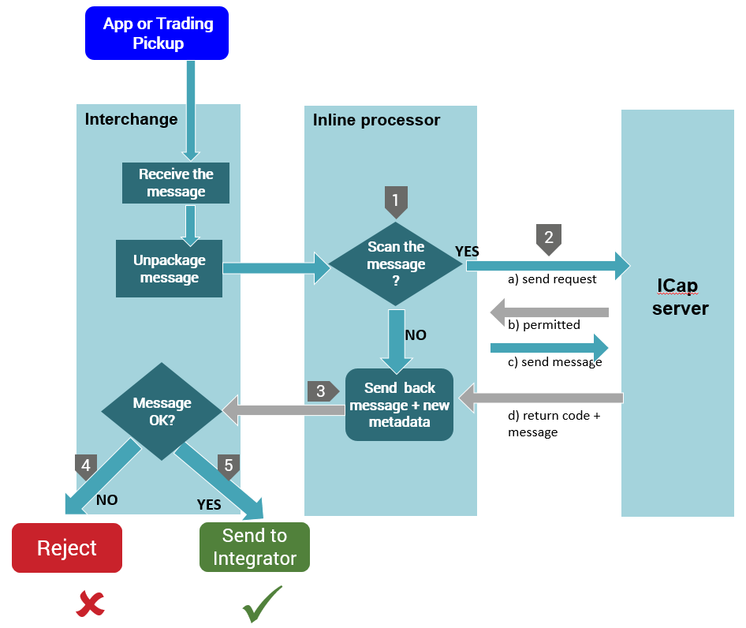

## The ICAP Inline Processor
The Internet Content Adaptation Protocol (ICAP) Inline Processor allows an administrator to configure ICAP engines to secure B2Bi exchange processes. This provides data loss prevention (DLP) and anti-virus (AV) scans. This option is preferable to the alternative of using non-secure connections and adding SSL coding, typically recommended against because of the negative performance impact.
The ICAP functionality for B2Bi is embedded in an Inline Processor. It can be added to a trading pickup as an attribute and as a message handler processing action

## Configuring the ICAP Inline Processor
### 1. Initial deployment
After the latest version of B2Bi is installed, and prior to the configuration of ICAP scanning within B2Bi, you must:\
**NOTE**\
The folder names may differ depending upon the version of B2Bi that is installed.

a. Locate the avScanner.properties file within this directory: B2Bi_installation\Interchange\samples\icapAv\
b. Deploy the configuration file (avScanner.properties) in this directory: B2Bi_share\common\conf\avConf. In the case of a B2Bi cluster, repeat this process on all the B2Bi cluster nodes.\
c. Deploy the generated antivirus-processor-1.0.0.jar file to: B2Bi_installation\Interchange\jars\
d. Add in B2Bi_installation\Interchange\conf\log4j2.xml file the line: 
`<Logger name="com.axway.antivirus" level="INFO"/>`

### 2. Update the avScanner.properties file
The anti-virus inline processor requires the Av-scanning properties to be configured correctly. The properties are auto-documented in the avScanner.properties file.
Properties include filters that specify which files are not to be scanned, based on criteria such as:

* max file size
* file extensions and/or file names
* protocols
* partners

### 3. Enable the AV-scanning
The following procedures explain how to enable AV-scanning in a trading pickup as a message attribute and the inline-processor in a message handler processing action.
Enable the AV-scanning as a message attribute on a trading pickup

1. Open a Trading or Application Pickup exchange definition.
2. Navigate to the Message attributes tab.
3. Add a fixed value to messages called for instance AVScan and set a value
4. Save the Trading pickup definition.

### 4. Enable the AV-scanning in a message handler processing action
1. Navigate to **Manage Trading Configuration**.
2. Select a Community.
3. Select **Processing** from the Community Map.
4. Select **Message Handler** from the Processing Map.
5. Select **Manage message processing actions**.
6. Select **Add a new message processing action**.
7. Create the condition that is required for the message handler processing action to execute. 
The condition contains the attribute set on the trading pickup and click **Next**.
8. Select as operator **Perform inline processing via a Java class** and use the following value in Class Name: **com.axway.antivirus.inlineprocessor.AntivirusProcessor**
9. Click **Next**.
10. Provide a friendly name and click **Finish**.

### 5. Monitoring the Scan process
**Log file ->**

After enabling the virus scan in your configuration, when a file that matches the criteria is scanned, the following entries appear in the Trading Engine log (TE.log), for example:

2018-08-23 06:18:50,726 - INFO [Thread-1028] (AntivirusConfigurationWatcher) - Antivirus configuration changed. File affected: avScanner.properties.\
2018-08-23 06:18:50,726 - INFO [Thread-1028] (AntivirusConfigurationManager) - Scanner configuration not present or modified - attempting to load it.\
2018-08-23 06:18:50,741 - DEBUG [Thread-1028] (AntivirusConfigurationHolder) - Scan from integrator value is: false\
2018-08-23 06:18:50,741 - DEBUG [Thread-1028] (AntivirusConfigurationHolder) - Reject file on error value is: true\
2018-08-23 06:18:50,741 - DEBUG [Thread-1028] (AntivirusConfigurationHolder) - Antivirus standard receive length is: 8192\
2018-08-23 06:18:50,741 - DEBUG [Thread-1028] (AntivirusConfigurationHolder) - The ICAP server version is: 1.0

### 6. The Message Tracker
In Message Tracker, a metadata attribute is added that indicates the scan status of the message.

## How the scanning process works
The following diagram illustrates the ICAP file scanning process when the scanning option is activated:

* If the message received from Interchange has restrictions defined in the **avScanner.properties** file, the Inline processor decides whether to scan the message or not
* If the message is to be scanned, the dialog between the Inline processor and the ICAP server is as follows:
1. The Inline processor sends the **OPTIONS** request to connect to the ICAP server
2. The ICAP server indicates which type of request are permitted and gives back the maximum size of the preview the server can use.
3. The Inline processor sends the message in chunks
4. The ICAP server sends a code and a message

* The inline processor sends the message with the new metadata back to Interchange - “AVScanStatus”- “AVScanInfo”
* The message is rejected if it is Infected or if an ERROR occurred
* The message is send to Integrator for processing.

##Notes and limitations:
1. If the backup option is activated, and the files are infected, a backup of the file is saved on the system.
2. If the backup option is disabled, the files are deleted directly.
3. The payload of the infected files cannot be viewed or downloaded from the Message Tracker.
4. If a message has more than one attachments, and these are infected: 
* the infected attachment is not sent to processing
* In the original message, the link for the failed attachment is still available
B2Bi

## Documentation
#### How to install the (opensource) ICAP antivirus server 
https://techweb.axway.com/confluence/display/RDBTOBI/Icap+antivirus+server+install
